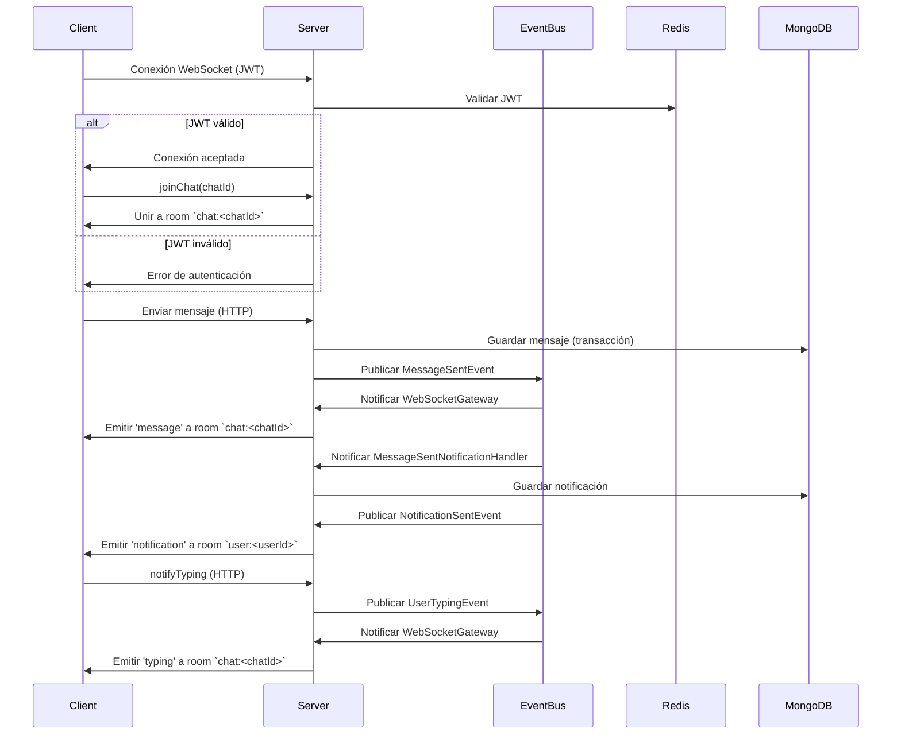

# WebSockets - Diseño Técnico

## 📌 Objetivo
Implementar comunicación en tiempo real para el chat utilizando WebSockets con Socket.IO. Esto permite:
- Recepción instantánea de mensajes.
- Notificaciones de "usuario escribiendo".
- Escalabilidad horizontal con Redis Adapter.

---

## 🏗️ Arquitectura

### Componentes
| Componente | Responsabilidad | Ubicación |
|-------------|----------------|-----------|
| `WebSocketGateway` | Manejar conexiones y eventos de Socket.IO | `src/infrastructure/websocket/gateway.ts` |
| `socketIOMiddleware` | Validar JWT en el handshake | `src/infrastructure/websocket/middleware.ts` |
| `EventBus` | Publicar/suscribir eventos de dominio | `src/infrastructure/events/InMemoryEventBus.ts` |
| `RedisAdapter` | Sincronizar rooms entre instancias | `@socket.io/redis-adapter` |
| `Notification` | Entidad de notificación | `src/domain/entities/Notification.ts` |
| `NotificationRepository` | Repositorio para notificaciones | `src/domain/entities/Notification.ts` |
| `MongooseNotificationRepository` | Implementación de NotificationRepository | `src/infrastructure/database/repositories/MongooseNotificationRepository.ts` |
| `NotificationModel` | Modelo de Mongoose para notificaciones | `src/infrastructure/database/models/NotificationModel.ts` |
| `SendNotificationUseCase` | Caso de uso para enviar notificaciones | `src/application/use-cases/SendNotificationUseCase.ts` |
| `ListNotificationsUseCase` | Caso de uso para listar notificaciones | `src/application/use-cases/ListNotificationsUseCase.ts` |
| `MarkNotificationAsReadUseCase` | Caso de uso para marcar notificaciones como leídas | `src/application/use-cases/MarkNotificationAsReadUseCase.ts` |
| `NotificationController` | Controlador para endpoints de notificaciones | `src/presentation/controllers/NotificationController.ts` |
| `MessageSentNotificationHandler` | Manejador para enviar notificaciones al recibir mensajes | `src/application/event-handlers/MessageSentNotificationHandler.ts` |
| `NotificationSentEvent` | Evento emitido cuando se envía una notificación | `src/domain/events/NotificationSentEvent.ts` |

---

## 🔐 Autenticación
- **Mecanismo**: JWT en el handshake (`socket.handshake.auth.token`).
- **Validación**: Middleware `socketIOMiddleware` verifica el token usando `JWTService`.
- **Seguridad**: Si el token es inválido, la conexión se rechaza inmediatamente.

---

## 📡 Eventos

### Eventos de Cliente → Servidor
| Evento | Payload | Descripción |
|--------|---------|-------------|
| `joinChat` | `{ chatId: string }` | Unir al usuario a la room del chat |
| `leaveChat` | `{ chatId: string }` | Abandonar la room del chat |

### Eventos de Servidor → Cliente
| Evento | Payload | Descripción |
|--------|---------|-------------|
| `message` | `{ id: string, chatId: string, senderId: string, content: string, createdAt: Date }` | Nuevo mensaje recibido |
| `typing` | `{ userId: string, chatId: string }` | Usuario está escribiendo |
| `notification` | `{ id: string, title: string, message: string, read: boolean, createdAt: Date, metadata?: Record<string, unknown> }` | Nueva notificación recibida |

---

## 🔔 Flujo de Notificaciones

1. **Evento disparador**: Cuando un usuario envía un mensaje, se publica un `MessageSentEvent` en el `EventBus`.

2. **Manejador de evento**: `MessageSentNotificationHandler` escucha el `MessageSentEvent` y determina el destinatario de la notificación.

3. **Creación de notificación**: Se crea una instancia de `Notification` y se guarda en MongoDB usando `NotificationRepository`.

4. **Evento de notificación**: Se publica un `NotificationSentEvent` en el `EventBus`.

5. **WebSocketGateway**: Escucha el `NotificationSentEvent` y emite un evento `notification` via WebSocket al usuario destinatario.

6. **Frontend**: El cliente escucha el evento `notification` y muestra la notificación al usuario.

7. **Marcar como leída**: Cuando el usuario ve la notificación, el frontend envía una petición `PATCH /notifications/:id/read` para marcarla como leída.

---

## 🚀 Escalabilidad
- **Redis Adapter**: Sincroniza rooms entre múltiples instancias de Socket.IO.
- **Rooms**: Cada chat tiene su propia room (`chat:<chatId>`). Cada usuario tiene una room personal (`user:<userId>`).
- **EventBus**: Los eventos de dominio se publican en memoria y son escuchados por `WebSocketGateway`.

---

## 🧪 Testing

### Unitarios
- **Objetivo**: Verificar la lógica de `WebSocketGateway` y la integración con `EventBus`.
- **Herramientas**: Jest + Socket.IO mock.
- **Cobertura**:
  - Manejo de conexiones.
  - Emisión de eventos.
  - Unirse/abandonar rooms.

### E2E
- **Objetivo**: Validar el flujo completo de WebSockets.
- **Herramientas**: Jest + `socket.io-client`.
- **Casos de prueba**:
  - Conexión autenticada con JWT.
  - Envío/recepción de mensajes.
  - Evento `USER_TYPING`.

---

## 📦 Variables de Entorno
| Variable | Descripción | Ejemplo |
|----------|-------------|---------|
| `CORS_ORIGIN` | Orígenes permitidos para CORS | `http://localhost:3000` |
| `REDIS_URL` | URL de Redis para Socket.IO Adapter | `redis://localhost:6379` |

---

## 🔄 Flujo de Eventos

### Envío de Mensaje
1. El cliente envía un mensaje vía HTTP (`POST /messages`).
2. `SendMessageUseCase` guarda el mensaje en MongoDB (transacción).
3. `SendMessageUseCase` publica `MessageSentEvent` en `EventBus`.
4. `WebSocketGateway` escucha `MessageSentEvent` y emite el mensaje a la room `chat:<chatId>`.
5. Todos los clientes en la room reciben el mensaje vía WebSocket.

### Notificación de "Usuario Escribiendo"
1. El cliente envía `POST /messages/typing` con `{ chatId, isTyping: true }`.
2. `NotifyUserTypingUseCase` publica `UserTypingEvent` en `EventBus`.
3. `WebSocketGateway` escucha `UserTypingEvent` y emite el evento a la room `chat:<chatId>`.
4. Todos los clientes en la room reciben la notificación vía WebSocket.
